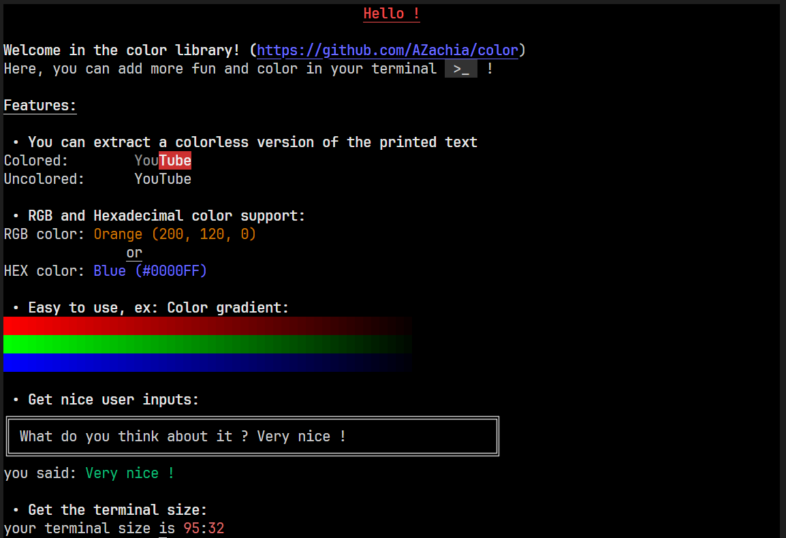

# color
color tools for terminal written in python




## Installation

Copy the [color.py](https://github.com/AZachia/color/blob/main/color.py) file in your directory.

## Documentation

 - import the library:
```python
import color
from color import cprint
```

 - to display colored text:
```python
cprint(color.red + "red text")
# or
cprint(color.blue, "blue text")
# or
cprint(f"{color.yellow}yellow text")
```

 - clear the terminal:

 ```python
color.clear()
```

 - Print Hexadecimal or RGB colors:

```python
# Foreground
cprint(color.get_rgb_print(200, 120, 0), "Orange text")
cprint(color.get_hex_print("#0000FF"), "Blue text")

# Background
cprint(color.get_rgb_print(200, 120, 0, True), "Orange text")
cprint(color.get_hex_print("#0000FF", True), "Blue text")
```


Written by [Galky](https://github.com/Gvlky) & [me](https://github.com/AZachia)

